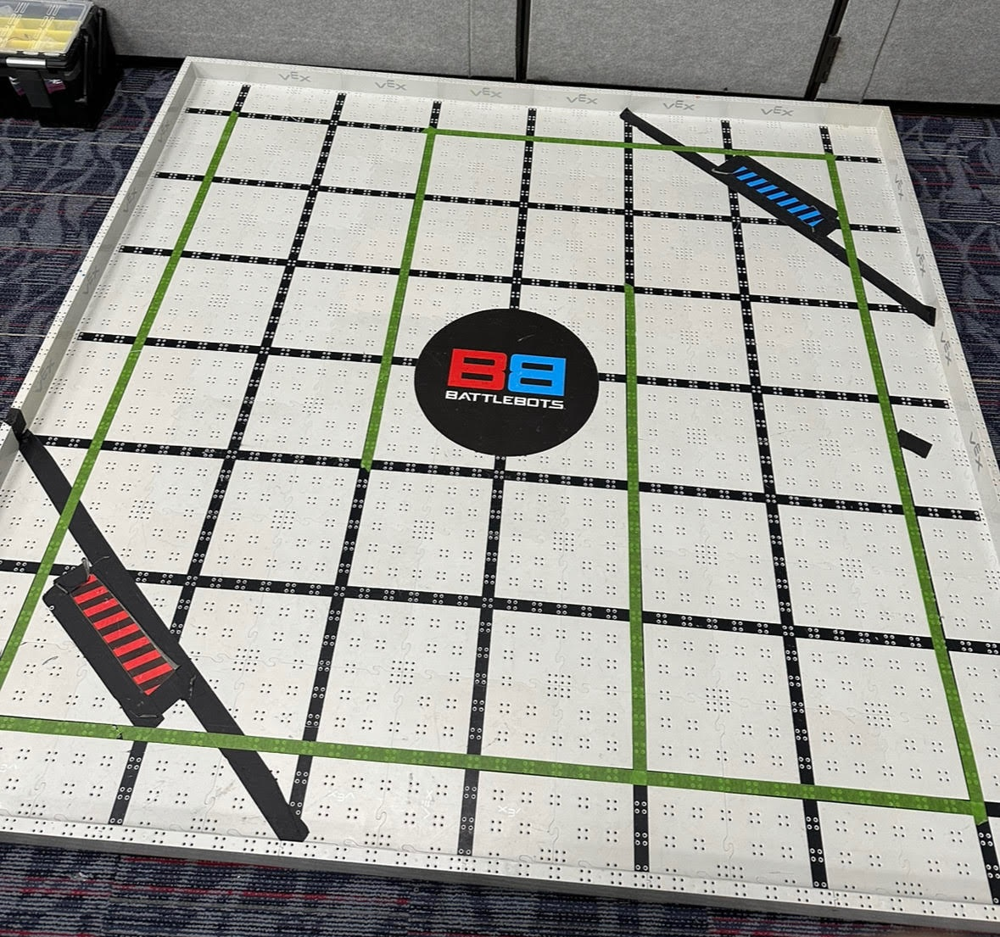
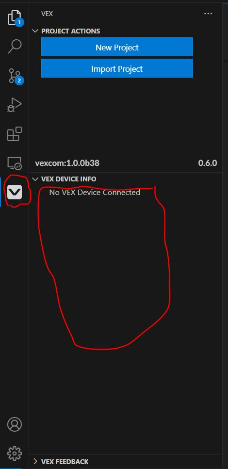

# BattleBots® Camp: Robotics Engineering with VEX Instructor Guide

# Introduction
This is mean to be a general guide based off the practices I have found useful while teaching this course.
# The Plan
When I am done with icebreakers and introductions, I give the kids a general overview of the course:

They will be building and programming our robots (probably in teams of 2 or 3) over the week. Their robot must complete one challenge and compete in two tournaments.

## Teams 
If two kids already know eachother or like eachother already I am happy to let them team up. If three kids want to team up, and one kid would rather work by him/herself, I am okay with that as well.

### Curating Teams

I generally try to curate the teams such that a quiet kid is not with another quiet kid. This is not always possble but is best practice.

## The Competitions
I've come up with three competitions.

The Autonomous competition is completed individually as teams.

The Sumo and Dice Game competitions are 1v1 tournaments. I generally try to do a double-elimination bracket if time allows.

### Setting up the playfield
Here's how I setup the playfield:



The green tape defines the course to follow for the Autonomous competition.

The black tape in the corners represent the starting positions in Sumo and Dice Game. Additionally, in Dice Game they represent goals.

### Autonomous
Referencing the image above, the students should write a program that completes the course withou any controller input. Students should create a *separate* vscode project for autonomous as the only code that will copy over from tankdrive is the instantiation of the motors. Students shouldn't even instantiate the controller in this project.

A robot starts at the bottom right and time ends when they hit the wall in the top left after completing the course.

The robot is not allowed to cross the green tape. I am not a strictler on this rule. If they graze it, I don't care. If they flagrantly violate the lines I will not accept the time.

I have found that the autonomous programs can be fairly inconsistent. Most of the time this isnt the kids' fault. If the wheels and motors on the robot are tight, then I do not care if their program is consistent. If their program completes the course without a violation one out of ten times, that's valid.

### Sumo
This one is the simplest. This is like wrestling. Two robots start in either corner of the playfield. Once the time starts, the winner of the battle is the first robot to prevent the other robot from moving *substantially* for 5 seconds. In other a robot wins by pinning/disabling the other robot. I give them a minute and thirty seconds for the match.

If any robot has two wheels leave the arena, that is an immediate loss.

Generally, the kids enjoy this tournament the most so I do it in front of the parents on Friday. There isn't time for a double-elimination tournament in front of the parents, so this one is almost always single-elimination.

### Dice Game
This one's my favorite, because I think it is the most strategic.

Two robots start in either corner, within the goal lines. For example Team 1 starts in the red goal, Team 2 starts in the blue goal. Teams must place four color-coordinated dice on their robots. For example, Team 1 puts red dice on their robot etc.

I am pretty picky about how to place the dice. The dice must be placed in a way such that it is accessible to the other robot. For example, students may not build walls around their dice or build a platform taller than the opponent robot to put the dice on.

Anyways, the teams place four dice on their robot. The objective is to get the opponents dice in your goal. For example, Team 1's objective is to get the blue dice on Team 2's robot into their own goal, the red goal. 

The drivers must stop moving their robot at a minute thirty for scoring. Scoring is simple. Each blue dice within the red goal at the end of time is one point for Team 1, vice versa. *A dice counts as a point even if it is still on a robot, as long as that dice is physically within the goal*.

Contact is allowed in Dice Game. A popular strategy is to get one point and then pin the opponent for the remaining time. This is valid.

## Building the Base

The first steps for students is to build the base of their robot. 

This is basically a rectangle that holds the brain, battery (using the battery clips), the wireless controller receiver, at least two motors, and wheels.

I give the kids two options: Come up with your own design, or follow the gameplan page "Vex > Build The Base".

It doesn't matter which ports on the brain the motors are plugged into.


## Programming Setup

The Gameplan says to use Vexcode (A program made by vex specifically for programming their robotic kits). I think that's dumb and that it's worse than VSCode. No one has ever heard of Vexcode, whereas VSCode is commonly used in industry. VSCode is pre-installed on the laptops.

### Setting up VSCode

This part doesn't take too long, unless the internet is ass.

Two extensions/extension packs must be installed:

+ [C/C++ Extension Pack](https://marketplace.visualstudio.com/items?itemName=ms-vscode.cpptools-extension-pack)

+ [VEX Robotics](https://marketplace.visualstudio.com/items?itemName=VEXRobotics.vexcode)


Follow [this guide](https://kb.vex.com/hc/en-us/articles/8608806329364-VS-Code-New-Project-for-V5) to create a new project. Students should select the blank template.

To program the robot, *students should only edit src/main.cpp*. 

To download the project to the brain, students should plug the brain into the laptop with a micro-USB cable. In my experience it's pretty plug and play.

You can tell that the brain is correctly connected by confirming that the brain is recognized in the Vex Device Info tab of the Vex action pane.



### Documentation
For reference, [here](https://www.robotmesh.com/studio/content/docs/vexv5-cpp/html/namespacevex.html) is the official Vex C++ documentation.


---

# h1 Heading 8-)
## h2 Heading
### h3 Heading
#### h4 Heading
##### h5 Heading
###### h6 Heading


## Horizontal Rules

___

---

***


## Typographic replacements

Enable typographer option to see result.

(c) (C) (r) (R) (tm) (TM) (p) (P) +-

test.. test... test..... test?..... test!....

!!!!!! ???? ,,  -- ---

"Smartypants, double quotes" and 'single quotes'


## Emphasis

**This is bold text**

__This is bold text__

*This is italic text*

_This is italic text_

~~Strikethrough~~


## Blockquotes


> Blockquotes can also be nested...
>> ...by using additional greater-than signs right next to each other...
sdasd> > > ...or with spaces between arrows.


## Lists

Unordered

+ Create a list by starting a line with `+`, `-`, or `*`
+ Sub-lists are made by indenting 2 spaces:
  - Marker character change forces new list start:
    * Ac tristique libero volutpat at
    + Facilisis in pretium nisl aliquet
    - Nulla volutpat aliquam velit
+ Very easy!

Ordered

1. Lorem ipsum dolor sit amet
2. Consectetur adipiscing elit
3. Integer molestie lorem at massa


1. You can use sequential numbers...
1. ...or keep all the numbers as `1.`

Start numbering with offset:

57. foo
1. bar


## Code

Inline `code`

Indented code

    // Some comments
    line 1 of code
    line 2 of code
    line 3 of code


Block code "fences"

```
Sample text here...
```

Syntax highlighting

``` js
var foo = function (bar) {
  return bar++;
};

console.log(foo(5));
```

## Tables

| Option | Description |
| ------ | ----------- |
| data   | path to data files to supply the data that will be passed into templates. |
| engine | engine to be used for processing templates. Handlebars is the default. |
| ext    | extension to be used for dest files. |

Right aligned columns

| Option | Description |
| ------:| -----------:|
| data   | path to data files to supply the data that will be passed into templates. |
| engine | engine to be used for processing templates. Handlebars is the default. |
| ext    | extension to be used for dest files. |


## Links

[link text](http://dev.nodeca.com)

[link with title](http://nodeca.github.io/pica/demo/ "title text!")

Autoconverted link https://github.com/nodeca/pica (enable linkify to see)


## Images


Like links, Images also have a footnote style syntax

![Alt text][id]

With a reference later in the document defining the URL location:

[id]: https://octodex.github.com/images/dojocat.jpg  "The Dojocat"


## Plugins

The killer feature of `markdown-it` is very effective support of
[syntax plugins](https://www.npmjs.org/browse/keyword/markdown-it-plugin).


### [Emojies](https://github.com/markdown-it/markdown-it-emoji)

> Classic markup: :wink: :cry: :laughing: :yum:
>
> Shortcuts (emoticons): :-) :-( 8-) ;)

see [how to change output](https://github.com/markdown-it/markdown-it-emoji#change-output) with twemoji.


### [Subscript](https://github.com/markdown-it/markdown-it-sub) / [Superscript](https://github.com/markdown-it/markdown-it-sup)

- 19^th^
- H~2~O


### [\<ins>](https://github.com/markdown-it/markdown-it-ins)

++Inserted text++


### [\<mark>](https://github.com/markdown-it/markdown-it-mark)

==Marked text==


### [Footnotes](https://github.com/markdown-it/markdown-it-footnote)

Footnote 1 link[^first].

Footnote 2 link[^second].

Inline footnote^[Text of inline footnote] definition.

Duplicated footnote reference[^second].

[^first]: Footnote **can have markup**

    and multiple paragraphs.

[^second]: Footnote text.


### [Definition lists](https://github.com/markdown-it/markdown-it-deflist)

Term 1

:   Definition 1
with lazy continuation.

Term 2 with *inline markup*

:   Definition 2

        { some code, part of Definition 2 }

    Third paragraph of definition 2.

_Compact style:_

Term 1
  ~ Definition 1

Term 2
  ~ Definition 2a
  ~ Definition 2b


### [Abbreviations](https://github.com/markdown-it/markdown-it-abbr)

This is HTML abbreviation example.

It converts "HTML", but keep intact partial entries like "xxxHTMLyyy" and so on.

*[HTML]: Hyper Text Markup Language

### [Custom containers](https://github.com/markdown-it/markdown-it-container)

::: warning
*here be dragons*
:::
