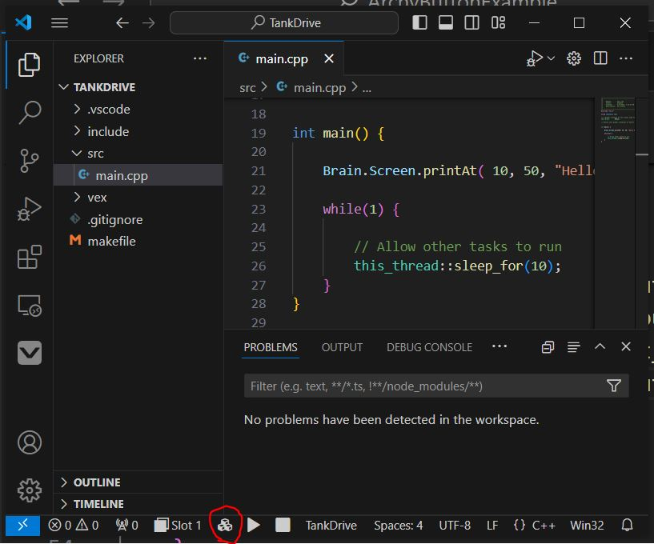

# BattleBots® Camp: Robotics Engineering with VEX Instructor Guide

# Introduction
This is mean to be a general guide based off the practices I have found useful while teaching this course.
# The Plan
When I am done with icebreakers and introductions, I give the kids a general overview of the course:

They will be building and programming our robots (probably in teams of 2 or 3) over the week. Their robot must complete one challenge and compete in two tournaments.

## Teams 
If two kids already know eachother or like eachother already I am happy to let them team up. If three kids want to team up, and one kid would rather work by him/herself, I am okay with that as well.

### Curating Teams

I generally try to curate the teams such that a quiet kid is not with another quiet kid. This is not always possble but is best practice.

## The Competitions
I've come up with three competitions.

The Autonomous competition is completed individually as teams.

The Sumo and Dice Game competitions are 1v1 tournaments. I generally try to do a double-elimination bracket if time allows.

### Setting up the playfield
Here's how I setup the playfield:

The green tape defines the course to follow for the Autonomous competition.

The black tape in the corners represent the starting positions in Sumo and Dice Game. Additionally, in Dice Game they represent goals.

### Autonomous
Referencing the image above, the students should write a program that completes the course withou any controller input. Students should create a *separate* vscode project for autonomous as the only code that will copy over from tankdrive is the instantiation of the motors. Students shouldn't even instantiate the controller in this project.

A robot starts at the bottom right and time ends when they hit the wall in the top left after completing the course.

The robot is not allowed to cross the green tape. I am not a strictler on this rule. If they graze it, I don't care. If they flagrantly violate the lines I will not accept the time.

I have found that the autonomous programs can be fairly inconsistent. Most of the time this isnt the kids' fault. If the wheels and motors on the robot are tight, then I do not care if their program is consistent. If their program completes the course without a violation one out of ten times, that's valid.

### Sumo
This one is the simplest. This is like wrestling. Two robots start in either corner of the playfield. Once the time starts, the winner of the battle is the first robot to prevent the other robot from moving *substantially* for 5 seconds. In other a robot wins by pinning/disabling the other robot. I give them a minute and thirty seconds for the match.

If any robot is knocked out of or leaves the arena and is unable to get back entirely within the arena under its own power that is an immediate loss.

Generally, the kids enjoy this tournament the most so I do it in front of the parents on Friday. There isn't time for a double-elimination tournament in front of the parents, so this one is almost always single-elimination.

### Dice Game
This one's my favorite, because I think it is the most strategic.

Two robots start in either corner, within the goal lines. For example Team 1 starts in the red goal, Team 2 starts in the blue goal. Teams must place four color-coordinated dice on their robots. For example, Team 1 puts red dice on their robot etc.

I am pretty picky about how to place the dice. The dice must be placed in a way such that it s accessible to the other robot. For example, students may not build walls around their dice or build a platform taller than the opponent robot to put the dice on.

Anyways, the teams place four dice on their robot. The objective is to get the opponents dice in your goal. For example, Team 1's objective is to get the blue dice on Team 2's robot into their own goal, the red goal. 

The drivers must stop moving their robot at a minute thirty for scoring. Scoring is simple. Each blue dice within the red goal at the end of time is one point for Team 1, vice versa. *A dice counts as a point even if it is still on a robot, as long as that dice is physically within the goal*.

Contact is allowed in Dice Game. A popular strategy is to get one point and then pin the opponent for the remaining time. This is valid.

## Building the Base

The first steps for students is to build the base of their robot. 

This is basically a rectangle that holds the brain, battery (using the battery clips), the wireless controller receiver, at least two motors, and wheels.

I give the kids two options: Come up with your own design, or follow the gameplan page "VEX > Build The Base".

It doesn't matter which ports on the brain the motors are plugged into.

## Programming Setup

The Gameplan says to use VEXcode (A program made by VEX specifically for programming their robotic kits). I think that's dumb and that it's worse than VSCode. No one has ever heard of VEXcode, whereas VSCode is commonly used in industry. VSCode is pre-installed on the laptops.

### Setting up VSCode

This part doesn't take too long, unless the internet is ass.

Two extensions/extension packs must be installed:

+ [C/C++ Extension Pack](https://marketplace.visualstudio.com/items?itemName=ms-vscode.cpptools-extension-pack)

+ [VEX Robotics](https://marketplace.visualstudio.com/items?itemName=VEXRobotics.vexcode)

Follow [this guide](https://kb.vex.com/hc/en-us/articles/8608806329364-VS-Code-New-Project-for-V5) to create a new project. Students should select the blank template.

To program the robot, *students should only edit src/main.cpp*. 

To download the project to the brain, students should plug the brain into the laptop with a micro-USB cable. In my experience it's pretty plug and play.

You can tell that the brain is correctly connected by confirming that the brain is recognized in the VEX Device Info tab of the VEX action pane.

To download the program to the robot, click the build and download button at the bottom of the screen.

Sometimes, I have noticed that the brain kind of freezes. I am not sure why this happens. This prevents the laptop from recognizing the robot and downloading to it. A workaround is to unplug the battery from the brain and plug it back in. Otherwise, as long as the code compiles without error, there should be no issue downloading to the robot.

The default empty template prints a message to the screen of the brain when run. I have kids run this program and see that the print is occuring to confirm everything is working correctly.

### Documentation
For reference, [here](https://www.robotmesh.com/studio/content/docs/vexv5-cpp/html/namespacevex.html) is the official Vex C++ documentation.

I find I don't have to reference this much as the VEX API is well integrated with the VSCode quick suggestions.

## Programming Tank Drive
Once it's confirmed that the students are able to download the program to their brains, it is time to start working on Tank Drive. Basically, in a Tank Drive, the left joysticks controls the left motor(s), and the right joystick controls the right motor(s).

I have provided an example bare-bones Tank Drive project at [examples/TankDrive](examples/TankDrive/src/main.cpp).

I generally teach programming concepts to the kids by first writing it myself so I am familiar with what to do. After that, I turn on the projector and have all the kids follow along as I write the program again line-by-line, explaining what I am doing both verbally and in comments.

For this lesson specifically, I start with spiel about how what we are doing is called Object Oriented Programming, talk about how objects in every-day-life can contain other objects, so that they can kind of understand what we are doing when instantiating the motors and the controller. 

Naturally, I also explain what variables are, how to define them, and some of the more popular types. I also explain that an Object is a type, and that we are creating an instance of that object. 

## The Rest of Day 1
Generally at this point I encourage the kids to begin thinking of/working on their weapon. For the rest of the day, I tell them to either come up with their own design or to copy one from the Gameplan under Build Time. I also introduce Dice Game and Sumo to them, and let them practice against eachother if they desire.

## Programming Autonomous
On Tuesday I introduce the students to the Autonomous challenge. Then I give a lesson based on the project I wrote at [examples/Auto](examples/Auto/src/main.cpp).

This involves introducing them to functions, and the parameters that go into those functions. I do not allow students to hardcode motor::spin and thread::sleep functions.

*Students should create a separate project just for the Autonomous challenge*.

## Running Autonomous
Autonomous is a LOT of guesing and checking, so most students should atleast take a couple hours to finish this. I give them until thursday morning to submit their final autonomous time. Students will be running back and forth between computer and the field, so it is important students are respectful and if someone get to the field first to let them run their autonomous first before puttin their robot on the field.

## Event-based Button Programming
At this point atleast a couple students have finished their weapons. Some will do spinny things others will have a claw, some will even have a claw on the end of an arm. The arm is a little more advanced to program and we will get to that next.

Event-based programming with buttons is really simple.

I give a lesson on how to do this and *have the kids add this to their existing Tank Drive*.

The example can be found at [examples/TankWithEventButtons](examples/TankWithEventButtons/src/main.cpp).

## Reaction-driven Button Programming
Eventually some students will ask you how to program the arm for their claw-arm. They want it so while they press up the arm will go up, while they press down the arm will go down, and when neither button is pressed the arm stays in place. Event-Based programming can't do this. A reaction-based approach is necessary.

Example at [examples/Reaction](examples/Reaction/src/main.cpp).

## Running the Tournaments
That's about it for the learning. 

On Friday, I do the Dice Game in the morning. Generally we have time for double-elimination.

If time allows, I do a single-elimination bracket for Sumo in front of the parents. 

I use [Challonge](https://challonge.com/tournament/bracket_generator) to create the brackets.

### How to handle a draw.
When playing Sumo or Dice Game, you may have a draw. If the parents time allows, I simply make them rematch until there is a winner. If there is no time for that, such as in front of the parents, there really is no choice. The winner has to be decided by coinflip. I have them play rock paper scissors so that they benefit from the illusion of control.

# Conclusion
Hope this guide was useful!